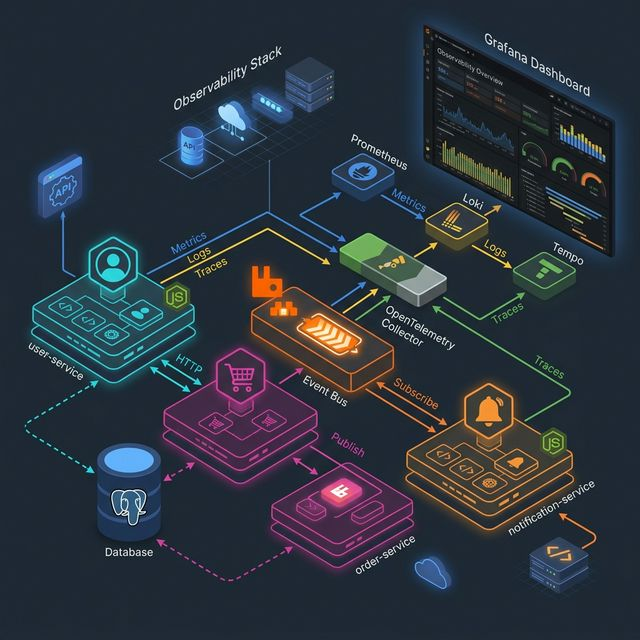

# Microservices Observability Stack: Deep-Dive Documentation

This project is a reference architecture for high-performance Node.js microservices with a state-of-the-art observability pipeline. It integrates distributed tracing, log aggregation, and custom metrics into a unified Grafana experience.

## 🏗️ System Architecture

Below is the detailed architectural diagram of the system, showing the microservices layer, the asynchronous messaging via RabbitMQ, the PostgreSQL data persistence, and the complete OpenTelemetry-driven observability stack.



---

## 📦 Service Breakdown

### 1. User Service (`port 3001`)
- **Responsibility**: Manages user profiles and authentication state.
- **Tech Stack**: Express.js, TypeScript, PostgreSQL.
- **Observability**: 
    - Tracks `user_created_total` metrics.
    - Captures CRUD operation traces.

### 2. Order Service (`port 3002`)
- **Responsibility**: Handles order creation and processing.
- **Communication**: 
    - **Synchronous**: Calls `user-service/users/:id` via HTTP to validate users.
    - **Asynchronous**: Publishes `ORDER_CREATED` events to RabbitMQ.
- **Observability**: 
    - Tracks `order_created_total` metrics.
    - Bridges internal logs to OTel via `pino-opentelemetry-transport`.

### 3. Notification Service (`port 3003`)
- **Responsibility**: Listens for system events and triggers alerts.
- **Communication**: Consumes messages from the `order_notifications` queue in RabbitMQ.
- **Observability**: Traces the asynchronous handoff from Order Service using OTel context propagation.

---

## 📡 The Observability Pipeline: From Code to Dashboard

### 1. Data Capture (Instrumentation)
Every service preloads `telemetry.ts` before startup. This script initializes the **OpenTelemetry Node SDK**.

```typescript
// Example: Global SDK Initialization in telemetry.ts
const sdk = new core.NodeSDK({
  resource: new Resource({
    [SemanticResourceAttributes.SERVICE_NAME]: process.env.OTEL_SERVICE_NAME,
  }),
  // Sends traces, metrics, and logs to the collector via OTLP
  traceExporter: new OTLPTraceExporter({ url: "http://otel-collector:4318/v1/traces" }),
  metricReader: new PeriodicExportingMetricReader({
    exporter: new OTLPMetricExporter({ url: "http://otel-collector:4318/v1/metrics" }),
  }),
  logRecordProcessor: new SimpleLogRecordProcessor(
    new OTLPLogExporter({ url: "http://otel-collector:4318/v1/logs" })
  ),
});
sdk.start();
```

### 2. Data Processing (OTel Collector)
The **OpenTelemetry Collector** acts as a buffer and transformer. It ensures that data is clean and correctly labeled before reaching the backends.

We use a `transform` processor to bridge resource attributes into indexed labels:
```yaml
# otel-collector-config.yaml
processors:
  transform:
    log_statements:
      - context: log
        statements:
          - set(attributes["service_name"], resource.attributes["service.name"])
          - set(attributes["loki.attribute.labels"], "service_name")
```
This configuration is critical: it tells Loki to use the `service_name` as a searchable index, allowing you to filter logs in Grafana instantly.

### 3. Data Storage & Querying
- **Tempo (Traces)**: Stores spans and traces. When an Order is created, you can see the trace starting in `order-service`, jumping to `user-service` for validation, and finally finishing in `notification-service`.
- **Loki (Logs)**: Aggregates logs. Logs are automatically injected with `trace_id`, enabling "Logs to Traces" correlation.
- **Prometheus (Metrics)**: Scrapes the OTel Collector's `/metrics` endpoint. It stores time-series data like HTTP request rates and custom business counters.

---

## 🔄 End-to-End Trace Example

When you run `./generate-traffic.sh`, a request to `/orders` triggers the following:

1.  **Frontend/Script**: Hits `order-service:3002/orders`.
2.  **Order Service**: 
    - Starts a NEW SPAN.
    - Logs "Creating order...".
    - Makes an HTTP call to `user-service`. The OTel SDK injects a `traceparent` header into this HTTP request.
3.  **User Service**:
    - Picks up the `traceparent` header.
    - Continues the SAME TRACE (starts a CHILD SPAN).
    - Returns user details.
4.  **Order Service**:
    - Publishes to RabbitMQ. OTel injects context into the message properties.
5.  **Notification Service**:
    - Consumes the message.
    - Extracts the OTel context from the properties.
    - Starts its own span as part of the original trace.

**The result**: You see a single trace ID across three services and multiple network boundaries.

---

## 🛠️ Developer Guide: Adding Telemetry

### Adding a New Log
Always use the exported `logger` instance. It is pre-configured to send data to the OTel pipeline.
```typescript
import { logger } from './logger';

logger.info({ orderId: '123' }, 'Order processed successfully');
```

### Adding a New Metric
Metrics are captured globally via the `MeterProvider`.
```typescript
import { metrics } from '@opentelemetry/api';

const meter = metrics.getMeter('order-service');
const counter = meter.createCounter('orders_rejected_total');
counter.add(1, { reason: 'invalid_user' });


App → Collector: Push (OTLP)
Collector → Tempo (Traces): Push
Collector → Loki (Logs): Push
Prometheus → Collector (Metrics): Pull

```
